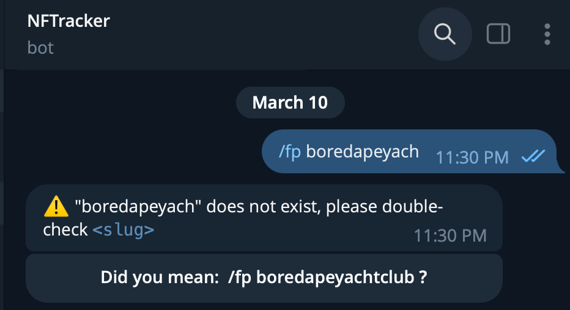

# Past Projects

List the projects that you have worked on directly.

- Clearly listing out the roles that you play in each of the projects, e.g. Designer, Developer.
- What is the state of the project? If launched, how many users did it get. Launched, not launched, etc.
- How long did you and your team take from ideation to launching it?
- What did you like or not like about it?

---

In general, I have worked on many projects that are launched on a large scale, i.e. most of the projects are personal projects and done in a solo capacity. That is why I usually play the role of designer, developer and product manager.

1. NFT collection
   In 2021, 5 friends and I launched an NFT collection. The role I played in the project was mainly the marketing manager and the backend developer. I wrote the image generation script to generate unique images from the assets that were produced by the artist, as well as working on community outreach. We managed to get a 1,000 people into the discord in 1 day, which eventually grew to 7,000 in a week, and 50,000 by the end of the project which had a runway of 1.5 months.

   We ideated for about a month, from the concept of the collection, to the deployment of the smart contract, and the development of the websites.

   What I loved about this project was a sense of ownership of the project, where even though we were pulling all-nighters, it did not feel exhausting at all.

2. Personal project - Telegram Bot to query NFT floor price

   

   

   NFTracker is a Telegram bot that allows users to query the floor price of NFT collections on Opensea in a very simple manner, by typing the `/fp` command, followed by the collection name (more specifically the slug name on opensea). Understanding that there might be some typo errors in the names of the collections, the Golang backend server is connected to a Postgres database to store the official slug names of popular collections. When the bot receives an invalid slug name, it will reach into the Postgres database to find the collection with the closest manage, with the prompt "Did you mean...?". Users can click on the callback button and the message will be replaced with the relevant information of the correct collection.

   I worked on this project alone. As the idea was pretty simple, the time from ideation to launch took about 3 weeks. What I liked about the project was that it is a simple yet effective tool that almost anyone can use it. Check it out here: https://t.me/NFTracker_bot

3. Personal project - Minority Game

   

   Minority game was inspired by an anime I once watched. The game gave players a question with 2 answers, and everyone would vote on either of the options. The voters belonging to the minority group would win the round and proceed on to the next stage. In this case, the idea is similar, but instead of votes, players would bet on the outcome by indicating their choice and transacting with the smart contrat. At the end of the game, players in the minority group would get their ethereum back, and the losers' pool would be distributed to the winners.

   I worked on this project alone. The ideation to launch took about 3 weeks too, and it was a great project to cultivate a deeper understanding of smart contracts. Check it out here: https://minority-game-dapp-front-end.vercel.app/
